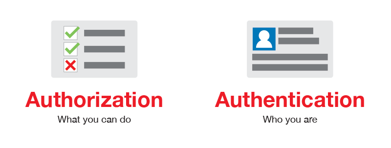

# Access control vulnerabilities

Controle de acesso é a parte da aplicação responsável por gerir a capacidade de cada usuário em acessar determinadas áreas do sistema, ou seja, ela tem por objetivo garantir a confidencialidade de arquivos restritos. Em aplicativos WEB a autenticação é o principal mecanismo para controlar o acesso.

Para entender melhor o contexto das vulnerabilidades no controle de acesso é necessário diferenciar dois conceitos de nomenclatura semelhante, mas com objetivos bem diferentes: autorização e autenticação.

### Autenticação

Consiste no conjunto de ferramentas utilizadas para atestar que o cliente é quem ele diz ser, em outras palavras, o usuário é submetido a procedimentos que são capazes de confirmar a sua identidade, bloqueando assim intrusos de acessarem suas informações.

### Autorização

Consiste no processo que ocorre após a confirmação de identidade. Desta forma, define quais são os privilégios que cada usuário possui dentro de um sistema.

Além disso, o controle de acesso também pode ser dividido em duas partes que definem dois fluxos de autorização, são eles:

### Controle de acesso vertical

Neste contexto, o acesso é definido pela classificação geral de cada usuário e a hierarquia destes no sistema, por exemplo, a diferenciação de privilégios de um administrador, mais acima da hierarquia do sistema com mais privilégios, de um usuário visitante, mais abaixo na hierarquia com menos privilégios. 

*A hierarquia citada não define a importância de cada funcionário na empresa como pessoa, apenas indica quais são os privilégios podem ser concedidos a cada um deles.*

### Controle de acesso horizontal

Neste cenário o acesso é controlado com base na individualidade de cada usuário, por exemplo, a diferenciação do acesso ao painel de configurações de conta. Em outras palavras, este controle garante a confidencialidade dos dados e funcionalidades de cada cliente 

## Vulnerabilidades

As vulnerabilidades inerentes ao controle de acesso, estão relacionadas a possibilidade de acessar funcionalidades e dados confidenciais por meio da fuga dos fluxos de autorização, caracterizando a quebra imediata da confidencialidade de um sistema.

Para exemplificar uma vulnerabilidade no fluxo de autorização irei utilizar um laboratório disponibilizado pela PortSwigger: “**User role controlled by request parameter”**

Após toda etapa de análise, foi identificado um diretório “/admin” responsável pela página de administrador. Entretanto esta está protegida por controle de acesso, exibindo a seguinte mensagém: 

Em seguida utilizei a ferramenta do desenvolvedor para analisar a requisição que realiza o retorno da mensagem de erro, foi identificado nos cookies um campo Admin, o qual possui valor “false”.

Com isso surgiu a ideia de alterar o valor passado utilizando o BurpSuite (*sera desenvolvido futuramente relatório sobre tal ferramenta e anexado aqui!)* para realizar requisições como usuário administrador. 

Assim foi possível realizar uma requisição de deletar conta sem ter a devida autorização para realizar tal operação no sistema e concluir o desafio.

*O exemplo utilizado será melhor desenvolvido na sua própria página posteriormente será anexada aqui!*