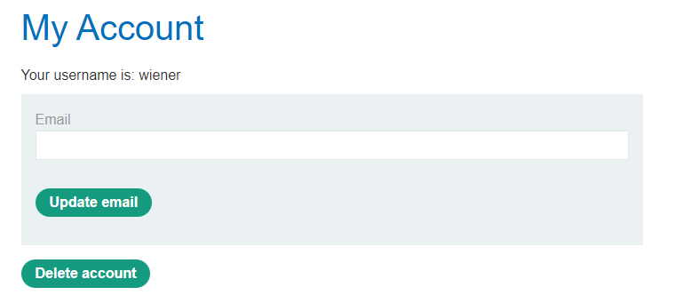

# Clickjacking

Diferente da maioria das vulnerabilidades, o clickjacking não tem o poder de afetar diretamente alguma funcionalidade do site, entretanto permite que sites falsos sejam criados utilizando de base o site orginal, utilizando de uma “mascara” para esconder as ações realizadas.

A principal “culpada” pelo ataque de clickjacking é a tag *iframe* nela é possível incluir no HTML uma página de fora do domínio e assim que os criminosos executam determinadas ações “por baixo dos panos” na página enviada a vítima.

A camuflagem citada é feita da seguinte forma: primeiro o atacante inclui a página alvo no HTML, por exemplo uma aba que contenha um botão de cancelar conta. Com isso, um botão sem funcionalidade é criado e pela utilização do CSS é posicionado de forma que fique sobreposto a ação de deletar conta, neste caso. O botão não deve ter nenhuma utilidade, servindo apenas de “isca”, por isso deve ser bem chamativo. Por fim a tag iframe receberá valor de opacidade 0 para permanecer oculta. Desta forma ao clicar no botão a ação realizada será no site alvo e não no site criado pelo atacante. 

Para esclarecer melhor um exemplo prático será desenvolvido utilizando como base o laboratório “****Basic clickjacking with CSRF token protection****”

- Primeiro passo: Identificar o recurso alvo
    
    Após realizar login com a conta pessoal é possível notar o botão “Delete Account”, portanto testaremos este.
    
    
    
- Segundo passo: Criar a página alvo
    
    A criação da página alvo é a parte mais complexa desta vulnerabilidade, será introduzido o conceito de “Z index”, o qual consiste na “sobreposição” dos elementos, o que possibilitará executar a ação da página alvo e não do botão criado, já que o iframe estará com valor 2, enquanto o botão recebe valor 1, portanto a página estará “por cima” do botão. O valor de posição “absolute” também é chave para o funcionamento da página, este permitirá o posicionamento exato do botão. É possível notar nas imagens a seguir que o botão fica exatamente sobreposto com a ação e após definir a opacidade do iframe para 0 apenas o botão estará na página.
    
    ```html
    <style>
        iframe {
            position:relative;
            width:800;
            height:600;
            opacity: 0.4;
            z-index: 2;
        }
        button {
            position:absolute;
            top:500;
            left:50;
            z-index: 1;
            background-color: red;
        }
    </style>
    <button>Clique AQUI!!!</button>
    <iframe src="https://acf91f8e1e897802c067348b001b00ab.web-security-academy.net/my-account"></iframe>
    ```
    


- Terceiro passo: Enviar a vítima
    
    Nos laboratórios da PortSwigger é necessário completar o desafio enviando a página falsa para a vítima, assim o laboratório será completo.
    
    
    
    