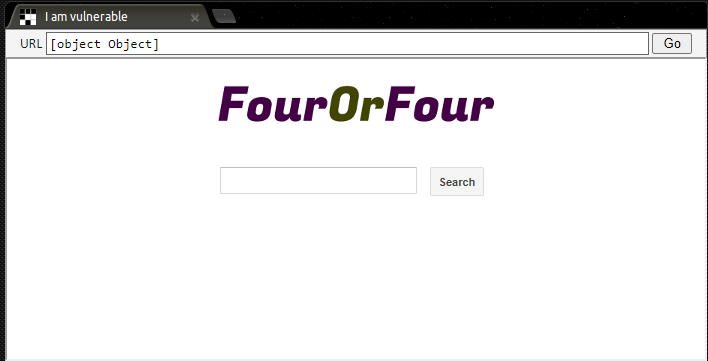

# Cross-Site Scripting (XSS)

Cross-Site Scripting (XSS) é um tipo de ataque de injeção, no qual são injetados códigos maliciosos em sites. Ocorrem predominantemente quando o atacante utiliza do navegador para enviar códigos maliciosos para seu usuário alvo. Pode estar relacionado com um ataque de engenharia social, quando busca forçar a vítima a clicar em algum link ou acessar alguma página.

Quando se trata de XSS há uma variedade enorme de ataques, podem permitir a trasnferencia de arquivos, cookies e outras informações de sessão. Esta falha pode implicar de algumas formas seu alvo e por isso foi dividida em tres sub-grupos: Refletido, armazenado e baseado no DOM.

### Armazenado:

Neste ataque o script fica armazenado no site e permanece injetado permanentemente no servidor, como em uma página de perfil. Desta forma, a vítima retorna o código malicioso do servidor quando solicitada o armazenamento. Contem em seu escopo outro tipo, blind Cross-Site Script, caracterizda pela carga útil estar armazenada no servidor e assim é refletida pelo backend das empresas.

### Refletido:

Este ataque consiste no script que é refletido no servidor da WEB como uma mensagem de erro, resultado de pesquisa ou qualquer outra resposta. Estes ataques na sua maioria precisam de engenharia social, para convencer o alvo de clicar no link enviado.

### Baseado no DOM:

Nesta categoria de XSS o ataque é realizado por meio de modificações no DOM e além disso não é possível notar a payload. Geralmente consiste em um ataque do lado do cliente, e a carga maliciosa nunca é enviada ao servidor, tornando-a mais avançada e crítica.

Agora vou utilizar de um site, “[xss-game.appspot.com](http://xss-game.appspot.com/)”, para exemplificar a vulnerabilidade em um ambiente adequado. No level 1 desta plataforma nos deparamos com uma barra de pesquisa na página e um botão que realiza a busca. 

Vou realizar o primeiro teste, apenas digitando a palavra “teste” e realizando a busca. É possível notar que a palavra foi REFLETIDA no corpo da página, ou seja, o que digitei no campo de busca foi manipulado de alguma forma pelo código fonte e inserido no corpo da aplicação.

Agora para gerar o exploit será necessário analisar o código fonte da página e identificar os elementos que o texto refletido está inserido.

Neste caso está dentro de uma tag “div” e por isso nosso payload iniciará com “
” para quebrar o código, por meio do fechamento da tag, e assim inserir a carga maliciosa. Para gerar uma prova de conceito devemos utilizar um comando que gere algum tipo de retorno visual claro, neste caso será utilizado o comando “alert()” que exibe um alerta na página (é o mais recomendado para CTF e POC). A payload será a seguinte: “
”. Ela realizará duas funções, inicialmente quebrar o código, como mencionado, e posteriormente inserir um campo de JavaScript dentro do código HTML da página, o qual será executado assim que a página carregar.

*Apesar de funcionar muito bem neste caso, esta payload ainda é muito primitiva para encontrar vulnerabilidades, já que dificilmente aplicações de filtragem vão permitir a inserção de uma tag <script> em um campo de buscas, por isso ao longo deste documento payloads mais complexas e funcionais serão geradas.*

Clicando na função de buscas nossa aplicação retornará o alerta solicitado no Script, o que indica que há a vulnerabilidade de XSS.
